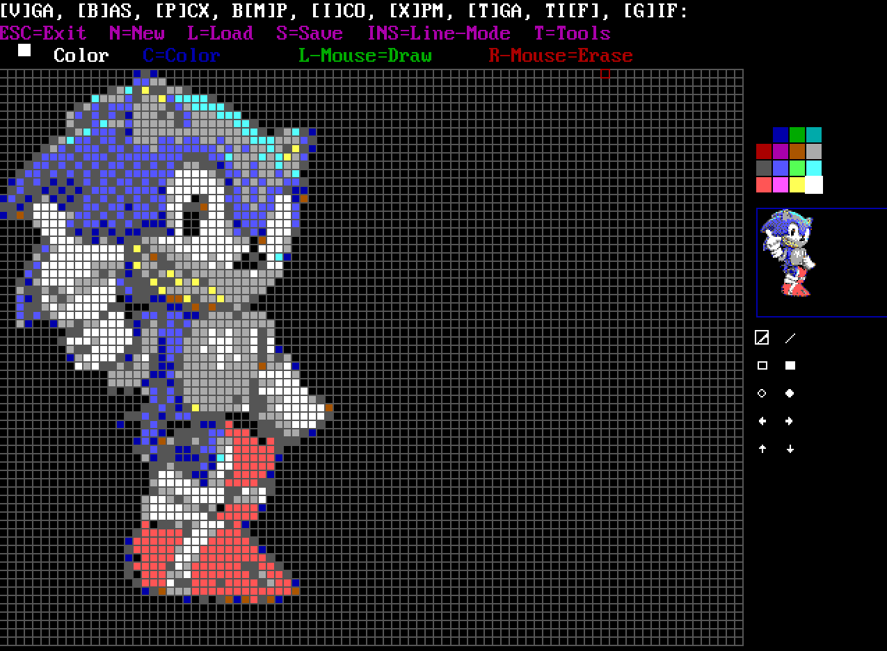

# 🎨 PB-VGAEditor

> A mouse-driven sprite editor for DOS, created for the [PB-Svga Library](https://github.com/Hawkynt/PB-SvgaLibrary).

## 🚀 Features

*   **Drawing:** Draw pixel by pixel using the mouse. 🖌️
*   **Color Palette:** Select from a 16-color palette. 🎨
*   **Grid:** A visual grid to help with alignment. 📏
*   **Preview:** A small preview window shows the sprite in its actual size. 🖼️
*   **File Operations:**
    *   Create a new sprite.
    *   Load and save sprites.
*   **Line Mode:** A mode for drawing straight lines. 📏

## 💾 File Formats

The editor supports several file formats for saving and loading sprites.

### Native Formats

These formats are designed for direct use in PowerBASIC projects.

*   **`.VGA` (Raw Binary Format):** A simple, uncompressed sequence of bytes representing the entire sprite canvas. It's fast to load but contains no metadata; the loading program must know the sprite's dimensions.
*   **`.BAS` (PowerBASIC Source Code):** A PowerBASIC source file containing the sprite data in `DATA` statements. It includes simple compression by trimming transparency, making it ideal for integration into PowerBASIC projects.

### Standard Image Formats

These are standard formats for broader compatibility. When saving in these formats, the editor automatically trims transparent borders to export only the visible parts of the sprite.

*   **`.PCX` (ZSoft Paintbrush):** A classic DOS-era image format that uses Run-Length Encoding (RLE) for compression. It supports a 256-color palette, though this editor uses the standard 16-color VGA palette.
*   **`.BMP` (Windows Bitmap):** A standard, uncompressed Windows image format. The editor saves 16-color BMP files, which are widely supported.
*   **`.ICO` (Windows Icon):** The standard format for icons in Windows. The editor creates 16-color icons, including the necessary transparency masks.
*   **`.XPM` (X PixMap):** A text-based image format commonly used in X Window System environments. It stores image data as C-style arrays, making it human-readable and easily embeddable in source code.

## 💻 How to Use

1.  You need a DOS environment with a VGA-compatible graphics card.
2.  Run the `VGAMAUS.BAS` file with a PowerBASIC compiler (like PowerBASIC 3.5).
3.  The editor will start, and you can use the mouse to draw on the canvas.
4.  Follow the on-screen instructions (in German) to use the different features.

### Controls

*   **Mouse:** Move the cursor and draw pixels.
*   **Left Mouse Button:** Draw with the selected color.
*   **Right Mouse Button:** Erase pixels (draw with color 0).
*   **`c` key:** Change the current color.
*   **`s` key:** Save the sprite.
*   **`l` key:** Load a sprite.
*   **`n` key:** Create a new sprite.
*   **`EINFG` (Insert) key:** Toggle line mode.
*   **`ESC` key:** Exit the editor.

## 🖼️ Screenshots

## 📜 License

This project is licensed under the LGPL 3.0 License. See the [LICENSE](LICENSE) file for details.