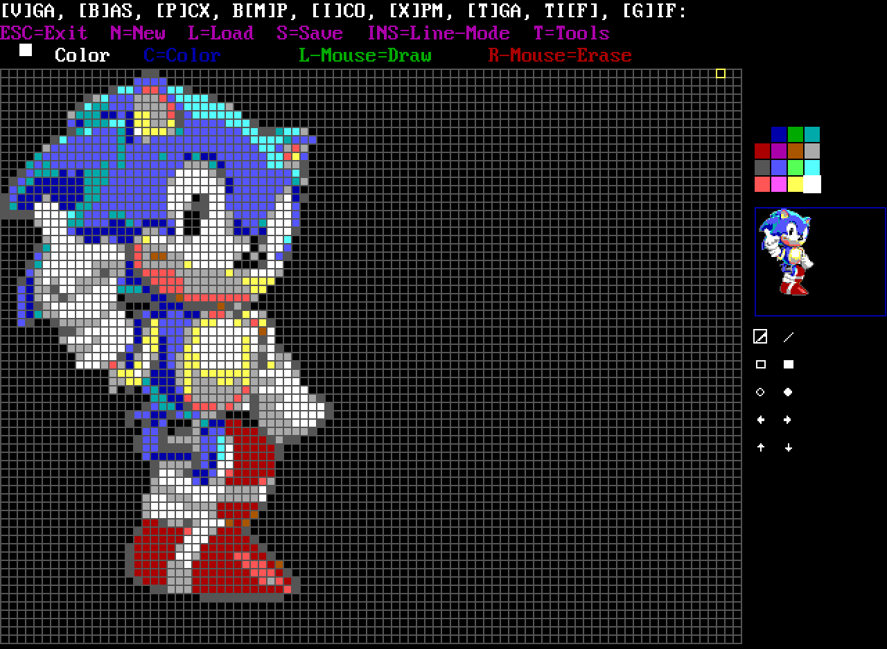

# 🎨 PB-VGAEditor

[](https://licenses.nuget.org/LGPL-3.0-or-later)
[](https://en.wikipedia.org/wiki/PowerBASIC)

> A mouse-driven sprite editor for DOS, created for the [PB-Svga Library](https://github.com/Hawkynt/PB-SvgaLibrary).

## 🚀 Features

*   **Drawing:** Draw pixel by pixel using the mouse. 🖌️
*   **Color Palette:** Select from a 16-color palette. 🎨
*   **Grid:** A visual grid to help with alignment. 📏
*   **Preview:** A small preview window shows the sprite in its actual size. 🖼️
*   **File Operations:**
    *   Create a new sprite.
    *   Load and save sprites.
*   **Line Mode:** A mode for drawing straight lines. 📏

## 💾 File Formats

The editor supports two file formats for saving and loading sprites, each with its own advantages.

### `.VGA` (Raw Binary Format)

This is a simple and direct way to store the sprite.

*   **Structure:** The file is a raw, uncompressed sequence of bytes. Each byte represents one pixel, and its value (0-15) corresponds directly to a color in the 16-color VGA palette.
*   **Pixel Order:** The pixels are stored from left-to-right and top-to-bottom, like reading a book.
*   **No Metadata:** The file contains **no header** or information about the sprite's dimensions (width/height). The program loading the file must know the dimensions beforehand to interpret the data correctly.
*   **Use Case:** Best for speed and simplicity when you have a fixed-size sprite and your program already knows its dimensions.

#### Example
Imagine a simple 4x3 sprite of a red arrow (color 4) on a transparent background (color 0).

```
....  (0,0,0,0)
.RR.  (0,4,4,0)
....  (0,0,0,0)
```

The `.VGA` file would be a sequence of 12 bytes, one for each pixel:
`00 00 00 00 00 04 04 00 00 00 00 00`

### `.BAS` (PowerBASIC Source Code)

This format is more advanced and is designed for easy integration into PowerBASIC projects.

*   **Structure:** The file is a complete, runnable PowerBASIC program. It contains a small "player" routine to draw the sprite and embeds the pixel data within `DATA` statements.
*   **Data Storage:** Each row of the sprite is stored as a string in a `DATA` statement. Each pixel's color is represented by a two-digit number (e.g., `"04"` for red). A final `DATA "99"` marks the end of the sprite.
*   **Simple Compression:** This format is more efficient than `.VGA` because it uses simple compression techniques:
    *   **Trimming:** Transparent pixels (color 0) at the beginning or end of a row are trimmed off.
    *   **Skipping Empty Rows:** Entirely transparent rows at the top or bottom of the sprite are omitted.
*   **Use Case:** Ideal for PowerBASIC developers. You can directly include this file in your project to display the sprite without needing to write a separate loading function.

#### Example
Using the same 4x3 red arrow sprite:

```
....  (Transparent row - will be skipped)
.RR.  (Row with data)
....  (Transparent row - will be skipped)
```

The `.BAS` file will contain the player code plus the following `DATA` statements. Notice how it only stores the data for the middle row, and even then, it trims the transparent pixels from the start and end.

```powerbasic
' ... player code ...
DATA "0404"
DATA "99"
' ... rest of the code ...
```
This is much more compact than the raw `.VGA` format for sprites with a lot of transparency.

## 💻 How to Use

1.  You need a DOS environment with a VGA-compatible graphics card.
2.  Run the `VGAMAUS.BAS` file with a PowerBASIC compiler (like PowerBASIC 3.5).
3.  The editor will start, and you can use the mouse to draw on the canvas.
4.  Follow the on-screen instructions (in German) to use the different features.

### Controls

*   **Mouse:** Move the cursor and draw pixels.
*   **Left Mouse Button:** Draw with the selected color.
*   **Right Mouse Button:** Erase pixels (draw with color 0).
*   **`c` key:** Change the current color.
*   **`s` key:** Save the sprite.
*   **`l` key:** Load a sprite.
*   **`n` key:** Create a new sprite.
*   **`EINFG` (Insert) key:** Toggle line mode.
*   **`ESC` key:** Exit the editor.

## 🖼️ Screenshots



## 📜 License

This project is licensed under the LGPL 3.0 License. See the [LICENSE](LICENSE) file for details.